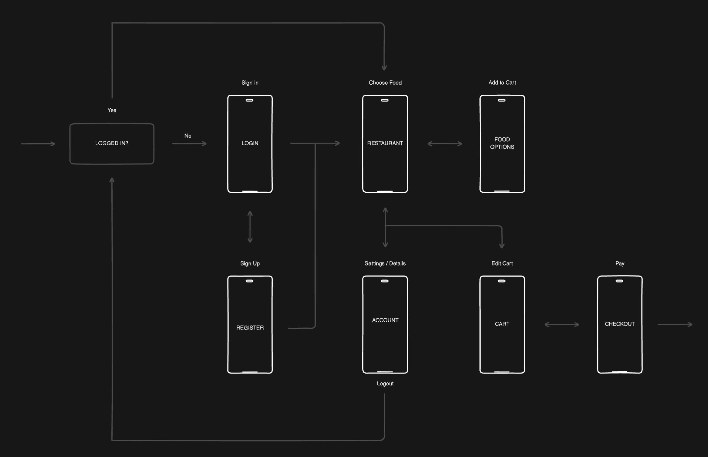
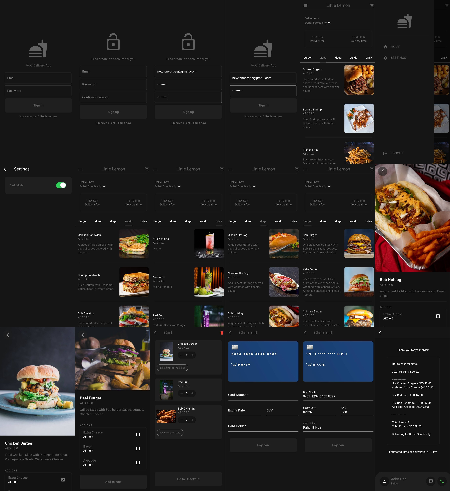

# Little Lemon 🍋

# Figma Design:

# Screenshot

Welcome to **Little Lemon**, a modern food delivery app designed to
provide a seamless and enjoyable user experience.
Below you'll find information about the app's functionality, pages, and dependencies.

## ⚙️ Functionality

- **Authentication**: Create a new account or log in to your existing account.
- **Browse Menu**: Explore various food categories such as burgers, salads, sides, desserts, and
  drinks. Easily add or edit food categories in the code.
- **Food Addons**: Customize each food item with special options available for selection.
- **Cart**: Manage your cart with options to add, remove, or adjust quantities. Proceed to checkout
  when ready.
- **Total Calculation / Receipt Generator**: Automatically calculates cart totals and generates a
  summary receipt.
- **Input Card Payment Details**: Securely input payment details for transactions.
- **Place Order**: Save orders to the backend database with real-time updates.
- **Light & Dark Mode**: Switch between light and dark themes for a personalized experience.
- **Sliver App Bar**: A modern, sleek app bar that stretches as you scroll.

## 📱 Pages (9)

1. **Login Page**
2. **Register Page**
3. **Home Page**
4. **Drawer Menu**
5. **Settings Page**
6. **Food Details Page**
7. **Cart Page**
8. **Payment Page**
9. **Delivery In Progress Page**

## 📦 Dependencies

- **flutter**: SDK for Flutter.
- **cupertino_icons**: ^1.0.6
- **provider**: ^6.1.2
- **collection**: ^1.18.0
- **flutter_credit_card**: ^4.0.1
- **intl**: ^0.19.0
- **firebase_core**: ^3.3.0
- **firebase_auth**: ^5.1.3
- **cloud_firestore**: ^5.2.0

## 🛠️ Development Dependencies

- **flutter_test**: SDK for Flutter testing.
- **flutter_lints**: ^3.0.0

Happy coding! 🚀